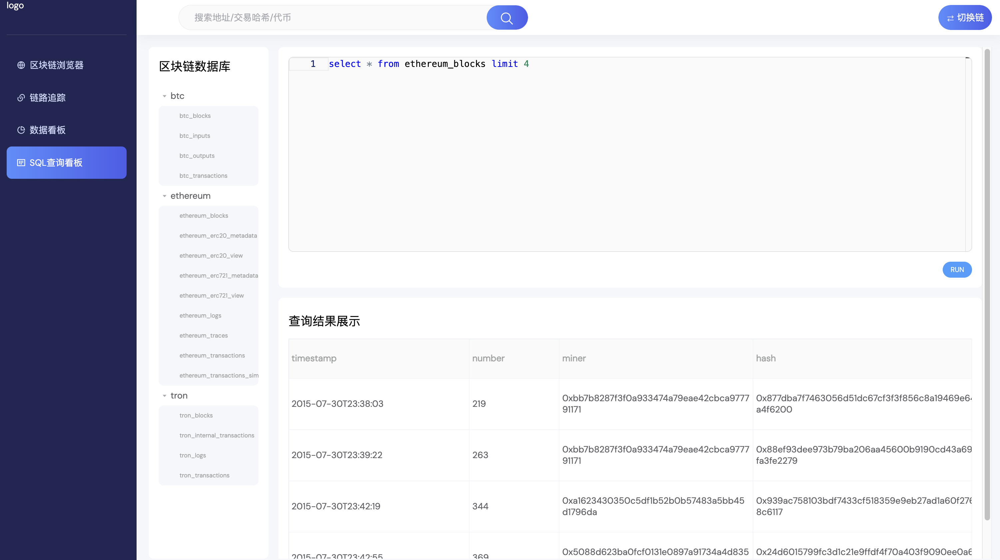

# 数据库sql查询

在左侧菜单栏选取SQL查询看板，即可进入下面界面，在输入sql语句的左侧，可以看到我们数据库的全部表的表名，你可以根据表名进行sql查询代码的书写。

点击右侧中央的RUN按钮，即可进行运行SQL查询，与后台分布式数据库进行交互，后台会将查询结果返回看板界面。可以通过滚动滚轮和滑动拖拽，进入指定区域查看。

<figure><figcaption>
SQL查询界面
</figcaption></figure>

全部数据库表内的字段，可以在下一节进行查看。

